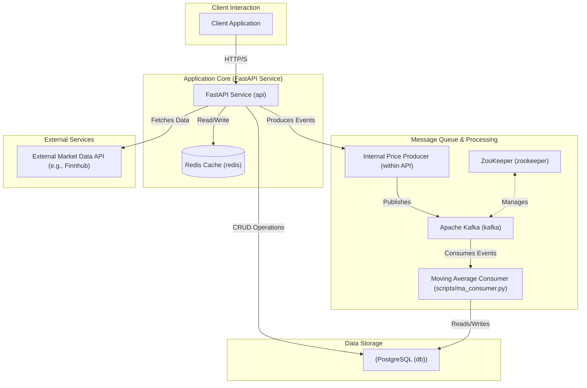
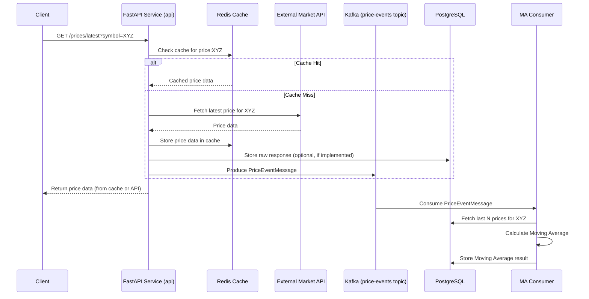

# Market Data Backend

## Overview

This backend system is designed to fetch, process, store, and serve market data, primarily focusing on stock prices. It retrieves data from external market APIs (like Finnhub), caches it for performance, publishes price events to a Kafka message queue for asynchronous processing, and stores both raw and processed data (e.g., moving averages) in a PostgreSQL database. The system exposes a FastAPI interface for client interactions.

## Features

*   **Real-time Price Fetching**: Retrieves the latest market prices for specified stock symbols.
*   **Provider Agnostic**: Designed to support multiple market data providers (currently Finnhub).
*   **Caching**: Utilizes Redis for caching API responses to reduce latency and external API calls.
*   **Asynchronous Processing**: Leverages Kafka to publish price events, enabling decoupled and scalable data processing (e.g., calculating moving averages).
*   **Persistent Storage**: Stores raw market data and calculated metrics (like moving averages) in a PostgreSQL database.
*   **RESTful API**: Provides API endpoints built with FastAPI for:
    *   Fetching latest prices.
    *   Initiating data polling jobs.
    *   Interactive API documentation (Swagger UI & ReDoc).
*   **Rate Limiting**: Implements middleware to protect API endpoints from abuse.
*   **Containerized**: Fully containerized using Docker and Docker Compose for easy setup, development, and deployment.
*   **CI/CD**: Includes a GitHub Actions workflow for continuous integration, testing, and deployment.

## Architecture

### High-Level Component Diagram

The system is composed of several interconnected services:



### Data Flow: Fetching Latest Price

The following sequence diagram illustrates the typical flow when a client requests the latest price for a stock symbol:



## Getting Started

### Prerequisites

*   [Docker](https://www.docker.com/get-started)
*   [Docker Compose](https://docs.docker.com/compose/install/)

### Setup

1.  **Clone the repository:**
    ```bash
    git clone <your-repository-url>
    cd MarketDataBackend
    ```

2.  **Create an environment file:**
    Copy the example environment file and populate it with your specific configurations, especially API keys.
    ```bash
    cp .env.example .env
    ```
    Then, edit `.env` with your details.

    **`.env.example`:**
    ```env
    # PostgreSQL Configuration
    POSTGRES_USER=your_postgres_user
    POSTGRES_PASSWORD=your_postgres_password
    POSTGRES_DB=marketdata
    DATABASE_URL=postgresql://${POSTGRES_USER}:${POSTGRES_PASSWORD}@db:5432/${POSTGRES_DB}

    # Redis Configuration
    REDIS_URL=redis://redis:6379

    # Kafka Configuration
    KAFKA_BROKER_ID=1
    KAFKA_ZOOKEEPER_CONNECT=zookeeper:2181
    KAFKA_LISTENERS=PLAINTEXT://:9092
    KAFKA_ADVERTISED_LISTENERS=PLAINTEXT://kafka:9092
    KAFKA_LISTENER_SECURITY_PROTOCOL_MAP=PLAINTEXT:PLAINTEXT
    KAFKA_BOOTSTRAP_SERVERS=kafka:9092

    # External API Keys
    FINNHUB_API_KEY=your_finnhub_api_key_here

    # Application Specific (Optional defaults, can be overridden by API requests or other means)
    # PROVIDER=finnhub
    # SYMBOLS=["AAPL", "MSFT"] # Default symbols for some operations if not specified
    # INTERVAL=60 # Default interval for some operations if not specified
    ```

### Running the Application

1.  **Build and start all services in detached mode:**
    ```bash
    sudo docker-compose up --build -d
    ```
    This command will build the Docker images if they don't exist and then start all the services defined in `docker-compose.yaml`.

2.  **To run a specific consumer script (e.g., Moving Average Consumer):**
    You might need to run consumer scripts within the context of the Docker network or by configuring them to connect to the exposed Kafka port if run locally. For development, you can execute it within the `api` container or a dedicated container.
    ```bash
    # Example: Execute the MA consumer script inside the running 'api' container
    sudo docker-compose exec api python scripts/ma_consumer.py
    ```
    *(Note: For a production setup, the MA consumer would typically run as its own persistent service, possibly defined in the `docker-compose.yaml` or deployed separately.)*

3.  **Accessing the API:**
    *   API Base URL: `http://localhost:8000`
    *   Interactive Docs (Swagger UI): `http://localhost:8000/docs`
    *   Alternative Docs (ReDoc): `http://localhost:8000/redoc`

4.  **Viewing Logs:**
    *   View logs for all services:
        ```bash
        sudo docker-compose logs -f
        ```
    *   View logs for a specific service (e.g., `api`):
        ```bash
        sudo docker-compose logs -f api
        ```

5.  **Stopping the Application:**
    ```bash
    sudo docker-compose down
    ```
    To remove volumes (like PostgreSQL data), add the `-v` flag: `sudo docker-compose down -v`.

## API Endpoints

*   **`GET /prices/latest`**:
    *   Description: Get the latest price for a given symbol from the selected provider.
    *   Query Parameters:
        *   `symbol` (string, required): Stock symbol (e.g., AAPL).
        *   `provider` (string, optional, default: "finnhub"): Data provider.
    *   Example: `curl -X GET "http://localhost:8000/prices/latest?symbol=MSFT&provider=finnhub"`

*   **`POST /prices/poll`**:
    *   Description: Start a polling job for a list of symbols at a given interval. (Note: The actual background polling mechanism based on this endpoint needs to be fully implemented, e.g., using Celery, APScheduler, or a dedicated polling service).
    *   Request Body:
        ```json
        {
          "symbols": ["AAPL", "MSFT"],
          "interval": 60
        }
        ```
    *   Example:
        ```bash
        curl -X POST "http://localhost:8000/prices/poll" \
             -H "Content-Type: application/json" \
             -d '{"symbols": ["GOOGL", "TSLA"], "interval": 70}'
        ```

## Key Technologies

*   **Backend Framework**: Python, FastAPI
*   **Database**: PostgreSQL (with SQLAlchemy ORM)
*   **Caching**: Redis
*   **Message Queue**: Apache Kafka (using `confluent-kafka` Python client)
*   **HTTP Client (Async)**: `aiohttp`
*   **Containerization**: Docker, Docker Compose
*   **Data Validation**: Pydantic
*   **Environment Management**: `python-dotenv`
*   **Testing**: Pytest, `pytest-asyncio`, `pytest-cov`
*   **CI/CD**: GitHub Actions

## Directory Structure

```
MarketDataBackend/
├── .env.example            # Example environment file for local development
├── .github/                # GitHub Actions CI/CD workflows
│   └── workflows/
│       └── ci.yml
├── app/                    # Main application source code
│   ├── api/                # API route handlers and request/response schemas
│   ├── core/               # Core components (config, database connection, middleware)
│   ├── models/             # SQLAlchemy database models
│   ├── services/           # Business logic (data providers, Kafka service, Redis cache)
│   └── main.py             # FastAPI application entry point and middleware setup
├── docker/                 # Docker-specific files
│   └── Dockerfile          # Dockerfile for the main API service
├── docs/                   # Project documentation (like this README)
├── requirements/           # Python dependency files (e.g., requirements.txt)
│   └── requirements.txt
├── scripts/                # Standalone scripts (e.g., Kafka consumers)
│   └── ma_consumer.py
├── tests/                  # Automated tests
│   ├── __init__.py
│   ├── conftest.py         # Pytest fixtures and configuration
│   ├── test_api.py         # Tests for API endpoints
│   ├── test_fastapi_external.py # External-facing API tests
│   ├── test_kafka_consumer.py # Tests for Kafka consumer logic
│   ├── test_routes.py      # Basic route tests
│   └── test_settings.py    # Test-specific settings
├── docker-compose.yaml     # Docker Compose configuration for all services
├── pytest.ini              # Pytest configuration file
└── requirements.txt        # (Potentially redundant, primary is in requirements/)
```
