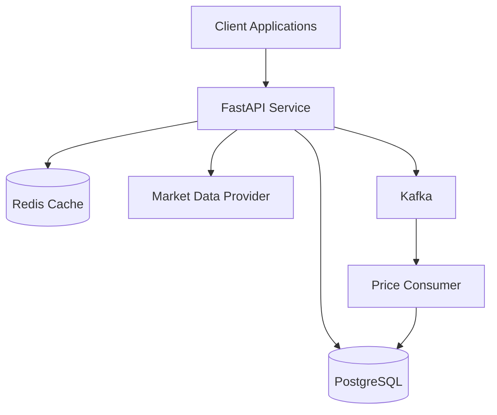
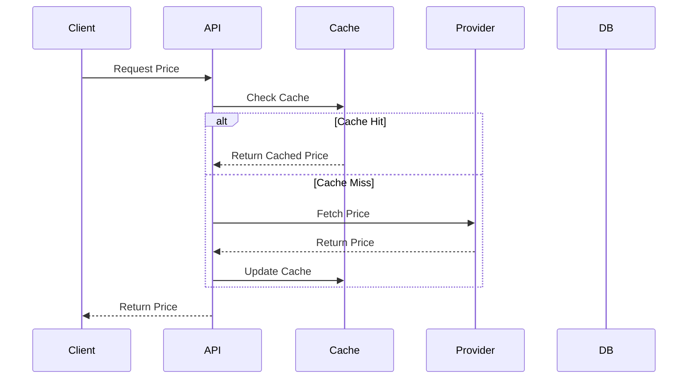
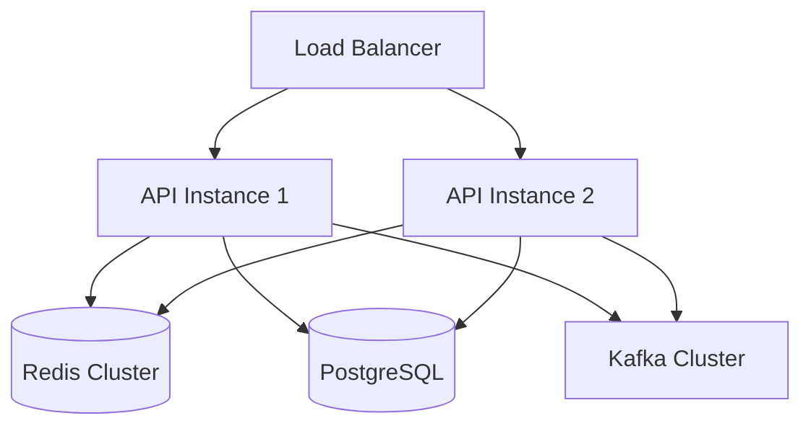

# Market Data Backend Architecture

## System Overview

## Component Details

### FastAPI Service
- Handles HTTP requests
- Implements rate limiting
- Manages caching
- Provides health checks
- Handles graceful shutdown

### Redis Cache
- Caches price data
- Implements rate limiting
- Stores temporary data

### PostgreSQL Database
- Stores historical price data
- Manages polling job configurations
- Maintains data consistency

### Kafka
- Handles asynchronous price updates
- Manages message queues
- Ensures reliable delivery

### Market Data Provider
- Fetches real-time market data
- Supports multiple providers
- Handles provider-specific logic

## API Flow

## Deployment Architecture

## Security Measures

1. Rate Limiting
   - Per-IP rate limiting
   - Redis-based implementation
   - Configurable limits

2. Authentication
   - API key authentication
   - JWT tokens (optional)
   - Role-based access control

3. Data Protection
   - HTTPS encryption
   - Secure secret management
   - Input validation

## Monitoring

1. Health Checks
   - Service health
   - Database connectivity
   - Redis connectivity
   - Provider status

2. Metrics
   - Request latency
   - Cache hit rates
   - Error rates
   - Resource usage

## Scaling Strategy

1. Horizontal Scaling
   - Multiple API instances
   - Load balancing
   - Stateless design

2. Caching Strategy
   - Redis caching
   - Cache invalidation
   - Cache warming

3. Database Scaling
   - Read replicas
   - Connection pooling
   - Query optimization 